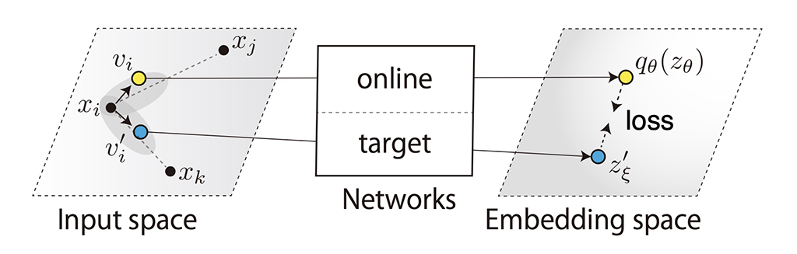
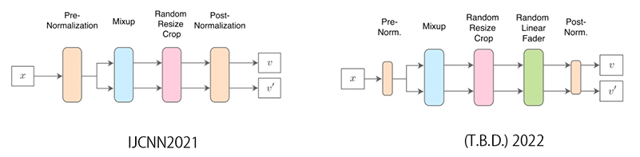
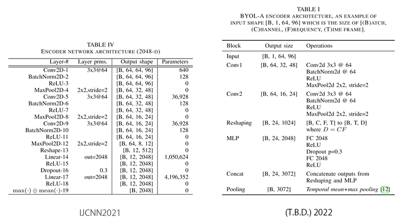

# BYOL for Audio: Exploring Pre-trained General-purpose Audio Representations

This is a demo implementation of BYOL for Audio (BYOL-A), a self-supervised learning method for general-purpose audio representation, includes:

- Training code that can train models with arbitrary audio files.
- Evaluation code that can evaluate trained models with downstream tasks.
- Pretrained weights.

UPDATE (Dec, 2022): The v2 is now [published on TASLP](http://dx.doi.org/10.1109/TASLP.2022.3221007)! We updated BibTeX.

UPDATE (Nov, 2022): New model definitions ([AudioNTT2020X, AudioNTT2020Task6X](byol_a/models.py#L105)) are ready. These are for making all layer features accessible so that the weighted sum of layer features can be available in [SUPERB](https://github.com/s3prl/s3prl/blob/master/s3prl/downstream/docs/superb.md).

UPDATE (May, 2022): We have two papers for BYOL-A.
If you find BYOL-A useful in your research, please use either of the following BibTeX entries for citation.
The former is the first paper from IJCNN2021 ([LINK to IEEE Xplore](http://dx.doi.org/10.1109/IJCNN52387.2021.9534474)), and the latter is ~~currently under review ([LINK to arxiv](https://arxiv.org/abs/2204.07402))~~ [published on TASLP](http://dx.doi.org/10.1109/TASLP.2022.3221007)!

```BibTeX
@inproceedings{niizumi2021byol-a,
    title={BYOL for Audio: Self-Supervised Learning for General-Purpose Audio Representation},
    author={Daisuke Niizumi and Daiki Takeuchi and Yasunori Ohishi and Noboru Harada and Kunio Kashino},
    booktitle = {2021 International Joint Conference on Neural Networks (IJCNN)},
    publisher={IEEE},
    DOI={10.1109/ijcnn52387.2021.9534474},
    url={http://dx.doi.org/10.1109/IJCNN52387.2021.9534474},
    year={2021},
    month={Jul}
}
```

```BibTeX
@article{niizumi2023byol-a,
    title={{BYOL for Audio}: Exploring Pre-trained General-purpose Audio Representations},
    author={Niizumi, Daisuke and Takeuchi, Daiki and Ohishi, Yasunori and Harada, Noboru and Kashino, Kunio},
    journal={IEEE/ACM Transactions on Audio, Speech, and Language Processing}, 
    publisher={Institute of Electrical and Electronics Engineers (IEEE)},
    year={2023},
    volume={31},
    pages={137–151},
    doi={10.1109/TASLP.2022.3221007},
    url={http://dx.doi.org/10.1109/TASLP.2022.3221007},
    ISSN={2329-9304}
}
```

## What is the difference between the papers?

We've added an augmentation block and updated network architecture.

We introduced an extra augmentation block, Random Linear Fader, in the 2022 version (TASLP2023).



We reduced the number of convolutional blocks from three to two and added a skip connection at a new Concat block on the 2022 version.



- For IJCNN2021, codes have not been changed; please find the details in this README.
- For TASLP2023(2022 version), 👉  please find codes in the [v2](v2) folder.

---

## Getting Started

1. Download external source files, and apply a patch. Our implementation uses the following.

    - BYOL implementation: https://github.com/lucidrains/byol-pytorch/blob/master/byol_pytorch/byol_pytorch.py
    - MLPClassifier for PyTorch: https://github.com/daisukelab/general-learning/blob/master/MLP/torch_mlp_clf.py

    ```sh
    curl -O https://raw.githubusercontent.com/lucidrains/byol-pytorch/2aa84ee18fafecaf35637da4657f92619e83876d/byol_pytorch/byol_pytorch.py
    patch < byol_a/byol_pytorch.diff
    mv byol_pytorch.py byol_a
    curl -O https://raw.githubusercontent.com/daisukelab/general-learning/7b31d31637d73e1a74aec3930793bd5175b64126/MLP/torch_mlp_clf.py
    mv torch_mlp_clf.py utils
    ```

2. Install [PyTorch 1.7.1](https://pytorch.org/get-started/locally/), torchaudio, and other dependencies listed on [requirements.txt](requirements.txt).

## Evaluating BYOL-A Representations

### Downstream Task Evaluation

The following steps will perform a downstream task evaluation by linear-probe fashion.
This is an example with [SPCV2; Speech commands dataset v2](https://arxiv.org/abs/1804.03209).

1. Preprocess metadata (.csv file) and audio files, processed files will be stored under a folder `work`.

    ```sh
    # usage: python -m utils.preprocess_ds <downstream task> <path to its dataset>
    python -m utils.preprocess_ds spcv2 /path/to/speech_commands_v0.02
    ```

2. Run evaluation. This will convert all .wav audio to representation embeddings first, train a lineaer layer network, then calculate accuracy as a result.

    ```sh
    python evaluate.py pretrained_weights/AudioNTT2020-BYOLA-64x96d2048.pth spcv2
    ```

You can also run an evaluation multiple times and take an average result. Following will evaluate on UrbanSound8K with a unit audio duration of 4.0 seconds, for 10 times.

```sh
# usage: python evaluate.py <your weight> <downstream task> <unit duration sec.> <# of iteration>
python evaluate.py pretrained_weights/AudioNTT2020-BYOLA-64x96d2048.pth us8k 4.0 10
```

Similarly, the following evaluates on NSynth (4.0 seconds long) 10 times.

```shell
python evaluate.py pretrained_weights/AudioNTT2020-BYOLA-64x96d2048.pth nsynth 4.0 10
```

### Evaluating Representations In Your Tasks

This is an example to calculate a feature vector for an audio sample.

```python
from byol_a.common import *
from byol_a.augmentations import PrecomputedNorm
from byol_a.models import AudioNTT2020


device = torch.device('cuda')
cfg = load_yaml_config('config.yaml')
print(cfg)

# ** Prepare the statistics in advance **
# You need to calculate the statistics of mean and standard deviation of the log-mel spectrogram of your dataset.
# See calc_norm_stats in evaluate.py for your reference.
stats = [-5.4919195,  5.0389895]

# Preprocessor and normalizer.
to_melspec = torchaudio.transforms.MelSpectrogram(
    sample_rate=cfg.sample_rate,
    n_fft=cfg.n_fft,
    win_length=cfg.win_length,
    hop_length=cfg.hop_length,
    n_mels=cfg.n_mels,
    f_min=cfg.f_min,
    f_max=cfg.f_max,
)
normalizer = PrecomputedNorm(stats)

# Load pretrained weights.
model = AudioNTT2020(d=cfg.feature_d)
model.load_weight('pretrained_weights/AudioNTT2020-BYOLA-64x96d2048.pth', device)

# Load your audio file.
wav, sr = torchaudio.load('work/16k/spcv2/one/00176480_nohash_0.wav') # a sample from SPCV2 for now
assert sr == cfg.sample_rate, "Let's convert the audio sampling rate in advance, or do it here online."

# Convert to a log-mel spectrogram, then normalize.
lms = normalizer((to_melspec(wav) + torch.finfo(torch.float).eps).log())

# Now, convert the audio to the representation.
features = model(lms.unsqueeze(0))
```

## Training From Scratch

You can also train models. Followings are an example of training on [FSD50K](https://zenodo.org/record/4060432#.YH2fYhT7RzU).

1. Convert all samples to 16kHz. This will convert all FSD50K files to a folder `work/16k/fsd50k` while preserving folder structure.

    ```sh
    python -m utils.convert_wav /path/to/fsd50k work/16k/fsd50k
    ```

2. Start training, this example trains with all development set audio samples from [FSD50K](https://zenodo.org/record/4060432#.YH2fYhT7RzU).

    ```sh
    python train.py work/16k/fsd50k/FSD50K.dev_audio
    ```

Refer to Table VI on our paper for the performance of a model trained on FSD50K.

## Pretrained Weights

We include 3 pretrained weights of our encoder network.

| Method | Dim.   | Filename                          | NSynth | US8K  | VoxCeleb1 | VoxForge | SPCV2/12 | SPCV2 | Average |
|:-------|:-------|:----------------------------------|:-------|:------|:----------|:---------|:---------|:------|:--------|
| BYOL-A | 512-d  | AudioNTT2020-BYOLA-64x96d512.pth  |  69.1% | 78.2% |     33.4% |    83.5% |    86.5% | 88.9% |   73.3% |
| BYOL-A | 1024-d | AudioNTT2020-BYOLA-64x96d1024.pth |  72.7% | 78.2% |     38.0% |    88.5% |    90.1% | 91.4% |   76.5% |
| BYOL-A | 2048-d | AudioNTT2020-BYOLA-64x96d2048.pth |  74.1% | 79.1% |     40.1% |    90.2% |    91.0% | 92.2% |   77.8% |

## License

This implementation is for your evaluation of BYOL-A paper, see [LICENSE](LICENSE) for the detail.

## Acknowledgements

BYOL-A is built on top of byol-pytorch, a BYOL implementation by [Phil Wang (@lucidrains)](https://github.com/lucidrains). We thank Phil for open-source sophisticated code.

```BibTeX
@misc{wang2020byol-pytorch,
  author =       {Phil Wang},
  title =        {Bootstrap Your Own Latent (BYOL), in Pytorch},
  howpublished = {\url{https://github.com/lucidrains/byol-pytorch}},
  year =         {2020}
}
```

## References
- BYOL: *[J.-B. Grill and F. Strub and F. Altché and C. Tallec and P. H. Richemond and E. Buchatskaya and C. Doersch and B. A. Pires and Z. D. Guo and M. G. Azar and B. Piot and K. Kavukcuoglu and R. Munos and M. Valko, "Bootstrap Your Own Latent - A New Approach to Self-Supervised Learning," 2020](http://arxiv.org/abs/2006.07733)*
- BYOL-A: *[Daisuke Niizumi, Daiki Takeuchi, Yasunori Ohishi, Noboru Harada, and Kunio Kashino "BYOL for Audio: Self-Supervised Learning for General-Purpose Audio Representation," 2021](https://arxiv.org/abs/2103.06695)*
- FSD50K: *[Eduardo Fonseca and Xavier Favory and Jordi Pons and Frederic Font and Xavier Serra, “FSD50K: an Open Dataset of Human-Labeled Sound Events,” 2020](https://arxiv.org/abs/2010.00475).*
- NSynth: *[Jesse Engel and Cinjon Resnick and Adam Roberts and Sander Dieleman and Mohammad Norouzi and Douglas Eck and Karen Simonyan, "Neural Audio Synthesis of Musical Notes with WaveNet Autoencoders," 2017](http://proceedings.mlr.press/v70/engel17a.html)*
- US8K: *[Justin Salamon and Christopher Jacoby, and Juan Pablo Bello, "A Dataset and Taxonomy for Urban Sound Research," 2014](http://www.justinsalamon.com/uploads/4/3/9/4/4394963/salamon_urbansound_acmmm14.pdf)*
- SPCV2: *[Pete Warden, "Speech Commands: A Dataset for Limited-Vocabulary Speech Recognition," 2018](https://arxiv.org/abs/1804.03209)*
- VoxCeleb1: *[Arsha Nagrani and Joon Son Chung and Andrew Zisserman, "VoxCeleb: A Large-Scale Speaker Identification Dataset," 2017](https://www.isca-speech.org/archive/Interspeech_2017/abstracts/0950.html)*
- VoxForge: *[K. MacLean, "VoxForge," 2018](http://www.voxforge.org/home)*
