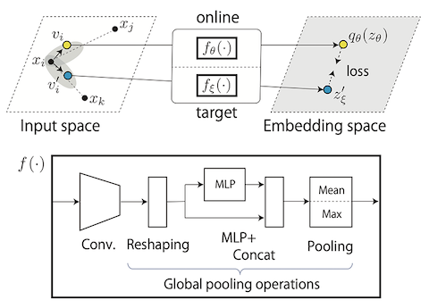
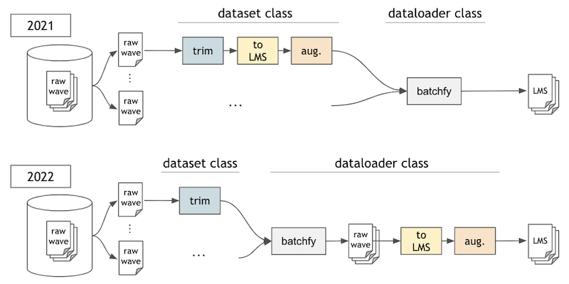

# BYOL for Audio: Exploring Pre-trained General-purpose Audio Representations

```BibTeX
@article{niizumi2023byol-a,
    title={{BYOL for Audio}: Exploring Pre-trained General-purpose Audio Representations},
    author={Niizumi, Daisuke and Takeuchi, Daiki and Ohishi, Yasunori and Harada, Noboru and Kashino, Kunio},
    journal={IEEE/ACM Transactions on Audio, Speech, and Language Processing}, 
    publisher={Institute of Electrical and Electronics Engineers (IEEE)},
    year={2023},
    volume={31},
    pages={137–151},
    doi={10.1109/TASLP.2022.3221007},
    url={http://dx.doi.org/10.1109/TASLP.2022.3221007},
    ISSN={2329-9304}
}
```

This sub-repository provides code of the [new version of BYOL-A](https://arxiv.org/abs/2204.07402), which updates:

- The augmentation module and network structure are extended.
- We evaluate our models using [EVAR](https://github.com/nttcslab/eval-audio-repr), enabling comparison with other publicly available pre-trained audio models on various downstream tasks.
- Minor implementation changes:
    - Renewed the data flow for converting raw audio to log-mel spectrogram in a batch.
    - We use [nnAudio](https://github.com/KinWaiCheuk/nnAudio) for converting raw audio into a log-mel spectrogram, because our preliminary experiments confirmed that the performance using [nnAudio](https://github.com/KinWaiCheuk/nnAudio) is better than using [torchaudio](https://github.com/pytorch/audio), and becomes closer to using [librosa](https://github.com/librosa/librosa).

        

---

## 1. Getting Started

1. Download external BYOL framework code (from [byol-pytorch](https://github.com/lucidrains/byol-pytorch)) and apply a patch.

    ```sh
    cd v2
    curl -O https://raw.githubusercontent.com/lucidrains/byol-pytorch/2aa84ee18fafecaf35637da4657f92619e83876d/byol_pytorch/byol_pytorch.py
    patch < ../byol_a/byol_pytorch.diff
    mv byol_pytorch.py byol_a2
    ```

2. Install [PyTorch 1.7.1](https://pytorch.org/get-started/locally/), torchaudio, and other dependencies listed on [requirements.txt](../requirements.txt).

## 2. Training From Scratch

Please find the training steps for the initial version in `Training From Scratch` in [../README.md](../README.md#training-from-scratch).

For the v2, we use `train_v2.py` instead of `train.py`.

```sh
python train_v2.py work/16k/fsd50k/FSD50K.dev_audio
```

## 3. Evaluating BYOL-A Representations

### 3-1. Evaluating Representations In Your Tasks

This example shows how to extract a feature vector of an audio sample from [SPCV2](https://arxiv.org/abs/1804.03209).

*NOTE:* You need to calculate the statistics (mean and std) for normalization in advance, such as `stats` found below.

```python
from byol_a2.common import load_yaml_config
from byol_a2.augmentations import PrecomputedNorm
from byol_a2.models import AudioNTT2022, load_pretrained_weights
import nnAudio.features
import torchaudio


device = torch.device('cuda')
cfg = load_yaml_config('config_v2.yaml')
print(cfg)

# ** Prepare the statistics in advance **
# The followings are mean and standard deviation of the log-mel spectrogram of input audio samples.
# For the SPCV2, this is calculated by using the EVAR terminal output:
#     > byol-a/v2/evar$ python lineareval.py config/byola2.yaml spcv2
#     >   :
#     > using spectrogram norimalization stats: [-9.660292   4.7219563]
stats = [-9.660292, 4.7219563]

# Preprocessor and normalizer.
to_melspec = nnAudio.features.MelSpectrogram(
    sr=cfg.sample_rate,
    n_fft=cfg.n_fft,
    win_length=cfg.win_length,
    hop_length=cfg.hop_length,
    n_mels=cfg.n_mels,
    fmin=cfg.f_min,
    fmax=cfg.f_max,
    center=True,
    power=2,
    verbose=False,
)
normalizer = PrecomputedNorm(stats)

# Load pretrained weights.
model = AudioNTT2022(n_mels=cfg.n_mels, d=cfg.feature_d)
load_pretrained_weights(model, 'AudioNTT2022-BYOLA-64x96d2048.pth')

# Load your audio file.
wav, sr = torchaudio.load('work/16k/spcv2/one/00176480_nohash_0.wav') # a sample from SPCV2 for now
assert sr == cfg.sample_rate, "Let's convert the audio sampling rate in advance, or do it here online."

# Convert to a log-mel spectrogram, then normalize.
lms = normalizer((to_melspec(wav) + torch.finfo(torch.float).eps).log())

# Now, convert the audio to the representation.
features = model(lms.unsqueeze(0))
```

### 3-2. Evaluating on the downstream tasks using EVAR

We use our evaluation package [EVAR (nttcslab/eval-audio-repr)](https://github.com/nttcslab/eval-audio-repr).

1. Run followings to clone your copy.

    ```sh
    echo "Setup EVAR (nttcslab/eval-audio-repr)."
    git clone https://github.com/nttcslab/eval-audio-repr.git evar
    cd evar
    curl https://raw.githubusercontent.com/daisukelab/general-learning/master/MLP/torch_mlp_clf2.py -o evar/utils/torch_mlp_clf2.py
    curl https://raw.githubusercontent.com/daisukelab/sound-clf-pytorch/master/for_evar/sampler.py -o evar/sampler.py
    curl https://raw.githubusercontent.com/daisukelab/sound-clf-pytorch/master/for_evar/cnn14_decoupled.py -o evar/cnn14_decoupled.py

    echo "Adding BYOL-A extensions to the EVAR folder."
    sed -i 's/import evar.ar_byola/import evar.ar_byola, evar.ar_byola2/' lineareval.py
    ln -s ../../byol_a2 external
    ln -s ../../to_evar/ar_byola2.py evar
    ln -s ../../to_evar/byola2.yaml config
    ```

2. Setup metadata (CSV files in the folder `evar/evar/metadata/*.csv`) and data samples (in the folder `evar/work/16k`); you need copies of datasets for evaluating models. See EVAR documents, [evar/README.md](https://github.com/nttcslab/eval-audio-repr/blob/main/README.md#2-setup), and [evar/Preparing-datasets.md](https://github.com/nttcslab/eval-audio-repr/blob/main/Preparing-datasets.md) for more information.

3. As a test, run the following command under the folder `evar`. This uses the pre-trained weight `v2/AudioNTT2022-BYOLA-64x96d2048.pth`. If you find accuracy result of about 0.64, your setup should be successful.

    ```sh
    cd evar
    python lineareval.py config/byola2.yaml cremad
    (Expected example of the result in the console output => "Linear evaluation: cremad_ar_byola2.AR_BYOLA2_e1346451 cremad -> 0.64281")
    ```

    If you want to evaluate your private pre-trained model, the following is an example to test on the ESC-50.

    ```sh
    python lineareval.py config/byola2.yaml esc50 weight_file=../checkpoints/AudioNTT2022-BYOLA-64x96d3072-2204281738-e100b256l0001r42-20d17c27.pth
    ```

### 3-3. Command lines for reproduction

The followings are the command lines used in the paper.

```sh
python 2pass_lineareval.py config/byola2.yaml fsd50k
python 2pass_lineareval.py config/byola2.yaml esc50 --lr=0.001
python 2pass_lineareval.py config/byola2.yaml us8k --lr=0.00003
python 2pass_lineareval.py config/byola2.yaml spcv2 --lr=0.00003
python 2pass_lineareval.py config/byola2.yaml nsynth --lr=0.001
python 2pass_lineareval.py config/byola2.yaml vc1 --lr=0.00004
python 2pass_lineareval.py config/byola2.yaml voxforge --lr=0.0001
python 2pass_lineareval.py config/byola2.yaml cremad
python 2pass_lineareval.py config/byola2.yaml surge --lr=0.00003
python 2pass_lineareval.py config/byola2.yaml gtzan batch_size=128 --lr=0.001
```

## License

This implementation is for your evaluation of BYOL-A paper, see [LICENSE](../LICENSE) for the detail.

## Acknowledgements

BYOL-A is built on top of [byol-pytorch](https://github.com/lucidrains/byol-pytorch), a BYOL implementation by [Phil Wang (@lucidrains)](https://github.com/lucidrains).

For audio feature conversion, we use [nnAudio](https://github.com/KinWaiCheuk/nnAudio) created by [Kin Wai Cheuk](https://github.com/KinWaiCheuk).

## Reference

- nnAudio: *[Kin Wai Cheuk and Hans Anderson and Kat Agres and Dorien Herremans, "Kin Wai Cheuk, Hans Anderson, Kat Agres, and Dorien Herremans," 2020](https://ieeexplore.ieee.org/abstract/document/9174990)*
